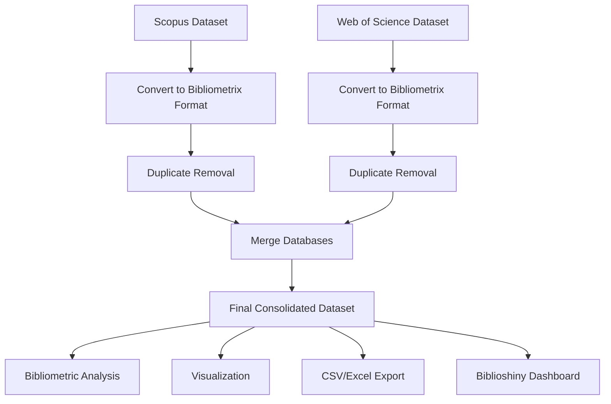

# 📚 AI-Assisted Programming in Programming Education  
### Bibliometric Analysis Pipeline with R & Bibliometrix

<p align="center">
  
</p>

<p align="center">


</p>

---

# 📖 About the Project

This repository contains the complete bibliometric analysis pipeline developed in **R** using the **Bibliometrix** ecosystem for a scientific study investigating the impacts and consequences of **AI-assisted programming** in **programming education**.

The project was designed to:
- collect and process scientific metadata from major academic databases;
- remove duplicates and normalize datasets;
- merge records from multiple sources;
- generate bibliometric indicators and visualizations;
- support reproducibility in scientific research.

The pipeline integrates datasets extracted from:
- **Scopus**
- **Web of Science (WoS)**

and produces a consolidated dataset used in the final scientific analysis.

---

# 🎯 Research Focus

The study investigates themes related to:

- AI-assisted programming
- Generative AI in education
- Programming education
- Educational impacts of AI coding assistants
- Large Language Models (LLMs)
- AI tools such as GitHub Copilot and ChatGPT
- Learning outcomes in programming
- Human-computer interaction in education

---

# 🧠 Motivation

The rapid adoption of AI-assisted coding tools has significantly transformed software development and programming education environments.

This project aims to provide:
- a reproducible bibliometric workflow;
- transparent data processing;
- structured scientific evidence;
- insights into research trends and gaps regarding AI-assisted programming in educational contexts.

---

# 🏗️ Repository Structure

```bash
.
├── bibliometrix.R
├── dados_completos.xlsx
├── arquivos_originais/
│   ├── scopus.bib
│   ├── WOS.bib
│   └── ...
├── docs/
│   └── images/
│       ├── banner.png
│       ├── workflow.png
│       └── dashboard.png
└── README.md
```

---

# 📂 Folder Description

| Folder/File | Description |
|---|---|
| `bibliometrix.R` | Main bibliometric analysis pipeline implemented in R |
| `dados_completos.xlsx` | Final consolidated dataset after cleaning and merging |
| `arquivos_originais/` | Original exported bibliographic datasets |
| `docs/images/` | Project images, figures and screenshots |
| `README.md` | Project documentation |

---

# ⚙️ Technologies Used

## 📌 Main Technologies

| Technology | Purpose |
|---|---|
| R | Statistical programming language |
| Bibliometrix | Bibliometric analysis framework |
| Biblioshiny | Interactive bibliometric dashboard |
| tidyverse | Data manipulation |
| ggplot2 | Data visualization |
| dplyr | Data wrangling |
| openxlsx | Excel file manipulation |

---

# 📦 Libraries and Dependencies

```r
library(plyr)
library(dplyr)
library(rlist)
library(bibliometrix)
library(openxlsx)
library(tidyverse)
library(readr)
library(stringr)
library(data.table)
library(forcats)
library(ggplot2)
library(tidyr)
library(purrr)
```

---

# 🔬 Bibliometric Pipeline

The workflow follows the steps below:



---

# 🚀 Installation

## Prerequisites

- R ≥ 4.0
- RStudio (recommended)

---

## Clone Repository

```bash
git clone https://github.com/your-username/your-repository.git
cd your-repository
```

---

## Install Required Packages

Run the following commands in R:

```r
install.packages("bibliometrix")
install.packages("plyr")
install.packages("dplyr")
install.packages("jsonlite")
install.packages("remotes")
```

Or install all dependencies automatically:

```r
packages <- c(
  "plyr",
  "dplyr",
  "rlist",
  "bibliometrix",
  "openxlsx",
  "tidyverse",
  "readr",
  "stringr",
  "data.table",
  "forcats",
  "ggplot2",
  "tidyr",
  "purrr"
)

install.packages(packages)
```

---

# ▶️ Running the Pipeline

Execute the main script:

```r
source("bibliometrix.R")
```

The pipeline will:

- import datasets;
- convert bibliographic formats;
- remove duplicates;
- merge databases;
- generate consolidated outputs;
- perform bibliometric analysis;
- launch Biblioshiny interface.

---

# 📊 Data Sources

The bibliometric datasets were collected from:

| Database | Format |
|---|---|
| Scopus | BibTeX |
| Web of Science | BibTeX |

---

# 📁 Output Files

| File | Description |
|---|---|
| `dados_completos.xlsx` | Final processed dataset |
| `artigos_final.csv` | Consolidated CSV dataset |
| Bibliometric plots | Automatically generated visualizations |

---

# 📈 Bibliometric Analysis Features

## Included Analyses

- Publication trends
- Most productive authors
- Citation analysis
- Source analysis
- Keyword co-occurrence
- Thematic evolution
- Collaboration networks
- Scientific production indicators

---

# 🖥️ Biblioshiny Dashboard

The project uses:

```r
biblioshiny()
```

to launch an interactive web interface for bibliometric exploration.

Features include:
- interactive charts;
- network visualization;
- thematic maps;
- citation analysis;
- country collaboration maps.

---

# 🧪 Methodological Workflow

## Pipeline Stages

### 1. Data Import
Import Scopus and WoS datasets.

### 2. Data Conversion
Convert BibTeX data to Bibliometrix-compatible structures.

### 3. Duplicate Removal
Remove duplicated publications using DOI matching.

### 4. Dataset Merge
Merge datasets into a unified database.

### 5. Final Export
Generate consolidated datasets in CSV and Excel formats.

### 6. Bibliometric Analysis
Perform statistical and scientific mapping analyses.

---

# 📸 Screenshots

## 📊 Bibliometric Dashboard

<p align="center">
  
</p>

---

## 🌐 Collaboration Networks

<p align="center">
  
</p>

---

# 📌 Main Research Topics Identified

- AI-assisted programming
- Generative AI
- ChatGPT in education
- GitHub Copilot
- Programming learning
- Human-AI collaboration
- Educational technologies
- Computer science education
- LLM-based tutoring

---

# 🔒 Reproducibility

This repository was designed to support:
- reproducible research;
- transparent methodology;
- open science practices;
- scientific workflow replication.

---

# 📋 Scripts Overview

| Script | Description |
|---|---|
| `bibliometrix.R` | Main bibliometric analysis pipeline |

---

# 🧱 Architecture

The project follows a modular scientific workflow architecture:

```text
Raw Data → Conversion → Cleaning → Deduplication → Merge → Analysis → Visualization
```

The pipeline emphasizes:
- reproducibility;
- transparency;
- data consistency;
- scientific rigor.

---

# ✅ Features

- [x] Scopus dataset processing
- [x] Web of Science dataset processing
- [x] Duplicate removal
- [x] Bibliographic merging
- [x] CSV export
- [x] Excel export
- [x] Bibliometric analysis
- [x] Interactive dashboard
- [x] Data visualization
- [x] Reproducible workflow

---

# 🚧 Roadmap

- [ ] Automated preprocessing scripts
- [ ] Docker environment
- [ ] Automated report generation
- [ ] Advanced network analysis
- [ ] NLP topic modeling
- [ ] Integration with additional databases
- [ ] Interactive web dashboard deployment

---

# 🧪 Testing

Future improvements may include:
- validation scripts;
- automated integrity checks;
- reproducibility verification;
- pipeline consistency testing.

---

# 🚀 Deployment

This project can be executed locally through:
- RStudio
- R CLI
- Docker (future support)

Potential future deployment platforms:
- ShinyApps.io
- Posit Connect
- Docker containers

---

# ⚡ Performance Considerations

The workflow is optimized for:
- medium-scale bibliographic datasets;
- DOI-based duplicate detection;
- efficient data wrangling with tidyverse/data.table.

---

# 🤝 Contributing

Contributions are welcome.

## Suggested Workflow

1. Fork the repository
2. Create a feature branch

```bash
git checkout -b feature/my-feature
```

3. Commit changes

```bash
git commit -m "feat: add new bibliometric analysis"
```

4. Push to branch

```bash
git push origin feature/my-feature
```

5. Open a Pull Request

---

## 📊 Data Collection

The bibliographic datasets used in this study were extracted from the following scientific databases:

- Scopus
- Web of Science (WoS)

### 📅 Extraction Date

All datasets were collected on:

> **November 20, 2025**

This extraction date is important to ensure:
- reproducibility of the bibliometric analysis;
- consistency of the scientific corpus;
- transparency regarding the temporal scope of the dataset.

The original exported files are available in the `arquivos_originais/` directory.


# 📜 License

This project is licensed under the MIT License.

See the `LICENSE` file for more details.

---

# 👨‍💻 Author

## Lucas Maia

- GitHub: https://github.com/your-username
- LinkedIn: https://linkedin.com/in/your-profile

---

# 🙏 Acknowledgements

Special thanks to:

- Bibliometrix developers
- R open-source community
- Scientific databases providers
- Researchers in programming education and AI

---

# 📚 References

- Aria, M., & Cuccurullo, C. (2017). bibliometrix: An R-tool for comprehensive science mapping analysis.
- Bibliometrix Documentation
- Scopus
- Web of Science

---

# ⭐ Citation

If this repository contributes to your research, please consider citing the associated article.

```bibtex
@article{yourcitation2026,
  title={AI-Assisted Programming in Programming Education: A Bibliometric Analysis},
  author={Author Name},
  year={2026}
}
```

---

<p align="center">
  Developed for scientific research and reproducible bibliometric analysis.
</p>

